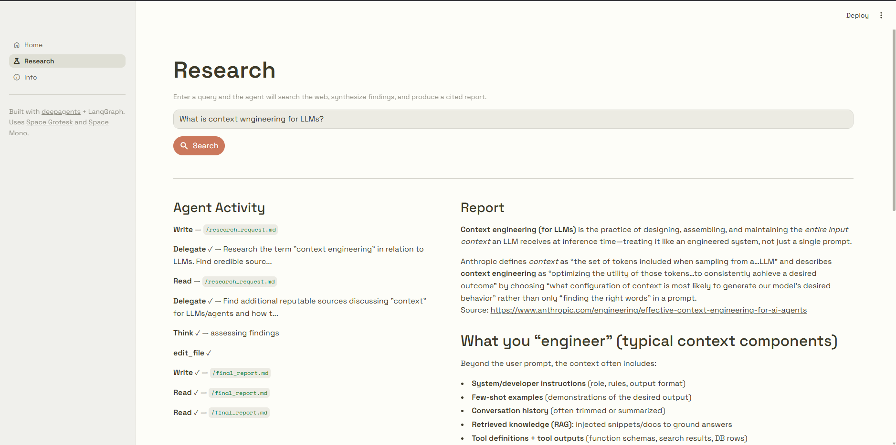
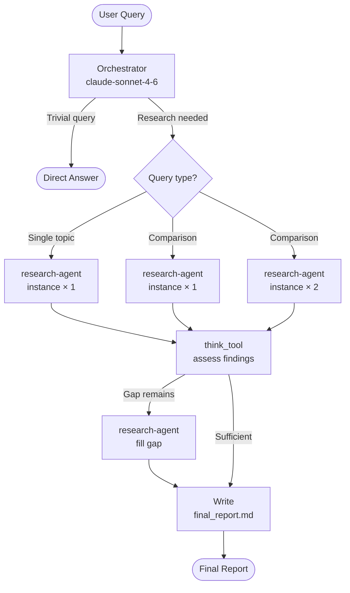
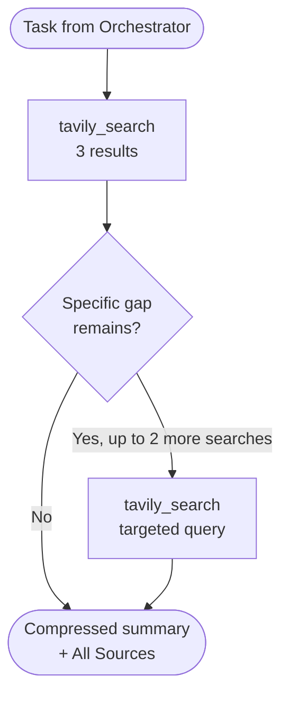
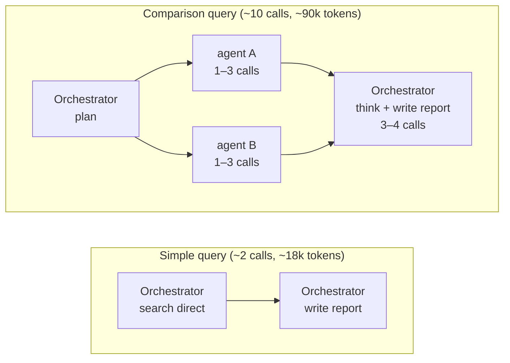

# Corporate IntelliOps Agent

A structured B2B intelligence platform built with [deepagents](https://github.com/langchain-ai/deepagents) and LangGraph. The user selects an intelligence mode and fills in structured context — the agent searches the web, synthesizes findings with mode-specific priorities, and delivers a cited report as PDF.

**Four intelligence modes:**
- **Due Diligence** — risk assessment for M&A, investment, or partnerships
- **Competitor Intel** — competitive landscape, positioning, and recent moves
- **Vendor Evaluation** — tool/vendor comparison before a procurement decision
- **Sales Intel** — account research before a prospect meeting



## Architecture

### Agent Flow



### Research Agent Loop



### LLM Call Budget



## Stack

| Component | Choice |
|---|---|
| LLM (primary) | `claude-sonnet-4-6` (Anthropic) |
| LLM (fallback) | `gpt-5.2` (OpenAI) |
| Agent framework | `deepagents` + LangGraph |
| Web search | Tavily API |
| Full page fetch | `httpx` + `markdownify` |
| Checkpointing | `InMemorySaver` (default) / PostgreSQL |
| API layer | FastAPI + SSE streaming |
| Frontend | Streamlit |
| PDF export | `xhtml2pdf` (Markdown → HTML → PDF) |

## Setup

```bash
# Install dependencies
uv sync

# Copy and fill environment variables
cp .env.example .env
```

Required keys in `.env`:

```env
ANTHROPIC_API_KEY=...   # primary LLM
OPENAI_API_KEY=...      # fallback LLM
TAVILY_API_KEY=...      # web search
```

Optional:

```env
SLACK_BOT_TOKEN=xoxb-...      # Slack bot token for PDF upload (scope: files:write)
SLACK_CHANNEL_ID=C0XXXXXXX    # target Slack channel
LANGSMITH_API_KEY=...         # observability
LANGGRAPH_DATABASE_URL=...    # persistent checkpoints (PostgreSQL)
MODEL_NAME=claude-sonnet-4-6
SUBAGENT_MODEL_NAME=claude-sonnet-4-6
MAX_CONCURRENT_RESEARCH_UNITS=2
MAX_SUBAGENTS_ITERATIONS=1
RECURSION_LIMIT=50
```

## Running

**Integration test (CLI):**

```bash
python tests/run_agent.py "what is context engineering for AI agents?"
```

**LangGraph dev server:**

```bash
PYTHONUTF8=1 uv run langgraph dev --no-reload --allow-blocking
```

**FastAPI server:**

```bash
uv run uvicorn backend.api:app --reload
```

## Design Patterns

Each architectural decision was made to solve a specific problem — this section documents the reasoning, not just the pattern.

### Factory — `backend/tools.py::create_tavily_search(max_calls)`

Each sub-agent gets its own `tavily_search` instance created by a factory function. The call counter lives inside a closure, making the limit per-instance and independent of other agents.

```python
def create_tavily_search(max_calls: int = 3):
    call_count = [0]
    @tool
    def tavily_search(...):
        if call_count[0] >= max_calls:
            return "HARD LIMIT REACHED..."
        call_count[0] += 1
        ...
    return tavily_search
```

**Why not a shared counter or prompt-only limit?** A shared counter would make agents compete for the budget. A prompt-only limit depends on the model obeying — the closure is deterministic: the model physically cannot exceed it regardless of what it decides.

---

### Strategy — `backend/agent.py::_init_llm()`

LLM selection uses a two-strategy chain: Anthropic (primary) → OpenAI (fallback), driven entirely by which API keys are present in the environment.

**Why:** avoids a hard dependency on a single provider. If `ANTHROPIC_API_KEY` is absent, the agent still runs. Adding a third provider is a new `elif` branch with no changes to the rest of the code.

---

### Middleware — `backend/agent.py` (`ToolRetryMiddleware`)

`ToolRetryMiddleware` is applied only to the orchestrator — not sub-agents. It catches `TimeoutError`, `ConnectionError`, and `UsageLimitExceededError`, retrying up to 3× with 2× exponential backoff.

**`SummarizationMiddleware` was removed.** It compressed context automatically, but the compression happened before the sub-agent finished its task — causing it to lose track of what it had already searched. The agent would re-search the same topics in a loop, burning tokens without making progress. Removing it and using explicit compressed summaries (returned by the research agent in a fixed format) solved the problem.

---

### Observer / Callback — `tests/run_agent.py::UsageTracker`

Extends LangChain's `BaseCallbackHandler` and hooks into `on_llm_end` to capture token usage and timing per call. Zero changes to production code.

**Why:** keeps the test harness non-intrusive. Adding new metrics means extending this class — nothing in the agent needs to know it's being observed.

---

### Builder — `backend/agent.py::build_agent()`

The agent graph is built in a fixed ordered sequence: env parsing → Pydantic validation → LLM init → tool instantiation → sub-agent construction → prompt assembly → graph creation → config injection.

**Why a fixed order matters:** each step depends on the previous one. Pydantic validation fails fast on bad env vars before any API call is made. Tools are instantiated before sub-agents so each agent gets a fresh factory instance. The order encodes the dependency graph explicitly.

---

### Per-request Prompt Injection — `backend/api.py::_load_mode_prompt()`

Mode-specific instructions are loaded from `backend/prompts/modes/` at request time and prepended to the user message — not baked into the system prompt at startup.

```
[mode prompt: research priorities + report structure]

---

[assembled query from build_query()]
```

**Why at request time:** `build_agent()` runs once at server startup. If mode instructions lived in the system prompt, the agent would carry all four modes' instructions in every request — including for modes not in use. Loading per request keeps context lean and instructions focused. It also means adding a new mode requires only a new `.md` file and one line in `MODE_FILES` — no agent rebuild.

---

### Adapter — `backend/api.py::event_stream()`

Translates LangGraph's internal message types (`AIMessageChunk`, `ToolMessage`) into typed SSE events (`token`, `tool_call`, `tool_result`, `error`, `done`) for the frontend.

**Why a single translation point:** the frontend and the agent are decoupled. If LangGraph changes its message format, only this function changes. The frontend only knows about SSE event types.

---

### Facade — `frontend/app/pages/research.py::stream_events()`

Wraps `httpx_sse.connect_sse` into a generator yielding `(event_type, data_dict)` tuples. All SSE connection logic, JSON parsing, and error handling is contained here.

**Why:** the streaming loop in the UI only has to handle business logic — what to render for each event type. Connection concerns are invisible to it.

---

### Dependency Injection — `backend/tools.py` (`InjectedToolArg`)

`max_results=3` is marked with `Annotated[int, InjectedToolArg]`, hiding it from the LLM's tool schema. The value is injected at runtime by the framework.

**Why:** the LLM sees a cleaner tool interface with fewer parameters to reason about. It also prevents the model from requesting more results than the system is designed to handle.

---

## Optimizations

### Implemented

**Sub-agent result compression**
Sub-agents return bullet-point summaries (max 300 words) instead of raw search results. This significantly reduces the context passed back to the orchestrator, which is the largest driver of token usage in multi-agent runs.

**Delegation shortcut for single-topic queries**
If the orchestrator classifies a request as single-topic, it delegates to a single `research-agent` instance instead of spawning multiple parallel agents. This eliminates unnecessary coordination overhead for the most common query type.

| Path | LLM calls | Total tokens |
|---|---|---|
| Single-topic (bypass) | ~2 | ~18k |
| Comparison (full multi-agent) | ~10 | ~90k |

**`think_tool` reserved for comparative runs**
Assessment via `think_tool` is skipped for single-topic queries. It is only used after sub-agent results come back in comparative runs, where assessing gaps across multiple research threads is actually useful.

**Hard cap via closure counter**
`tavily_search` enforces a call limit at the code level (5 searches per sub-agent instance). When reached, the tool returns a blocking message that instructs the model to stop searching and write its summary immediately. This prevents runaway search loops regardless of model behavior.

**Sources exempt from compression limit**
The 300-word cap on sub-agent summaries applies only to the Key Findings section. The Sources list has no word limit — every URL found across all searches is returned. This ensures the orchestrator always has full citation coverage for the final report.

**Mode-specific prompts loaded per request**
Each intelligence mode loads only its own prompt file at request time. The system prompt stays fixed and small. A generic research query adds ~0 tokens of mode overhead; a structured intelligence operation adds only the active mode's instructions (~200–300 tokens), not all four modes at once.

---

### Planned (Phase 5)

**Search cap calibration per mode**
The current 5-search hard cap per sub-agent instance was set for general queries. Comparative modes (Competitor Intel, Vendor Evaluation) cover more dimensions and may need further adjustment to deliver all required deliverables without gaps. The plan is to test each mode, identify where findings are thin, and adjust the cap accordingly — then re-test and compare token usage against the baseline.

**Route report-writing to a cheaper model**
The final report-writing step is the most token-intensive call, but it requires less reasoning than the research and planning steps. Routing it to a smaller model (e.g. `claude-haiku-4-5`) instead of Sonnet could reduce cost significantly without impacting output quality for well-structured reports.

---

## Example Output

See [`examples/final_report.md`](examples/final_report.md) for a sample report generated by the agent.

## Performance Benchmarks

| Query type | LLM calls | Total tokens | Latency |
|---|---|---|---|
| Simple / single-topic | ~2 | ~18k | ~15–20s |
| Comparison / deep research | ~10 | ~90k | ~75s |

## Framework Comparison

Benchmarked against an equivalent single-agent implementation using [agno](https://github.com/agno-agi/agno) on the same query and model family.

| Metric | corporate-intelliops-agent | agno (single-agent) |
|---|---|---|
| Model | claude-sonnet-4-6 | claude-sonnet-4-5 |
| Total tokens | ~62k | ~51k |
| Latency | ~113s | ~103s |
| TTFT | 73ms | 1.566s |
| Sources cited | 7–8 | 6 |
| Output tokens | 6,742 | 4,699 |

**Trade-offs:** agno produces more concise output at lower cost for single-topic queries. corporate-intelliops-agent has significantly lower TTFT (better streaming UX), richer output, and scales to parallel multi-agent research for comparison queries — where agno's single-agent approach would run searches sequentially.

## Roadmap

See [ROADMAP.md](ROADMAP.md) for the full roadmap.
